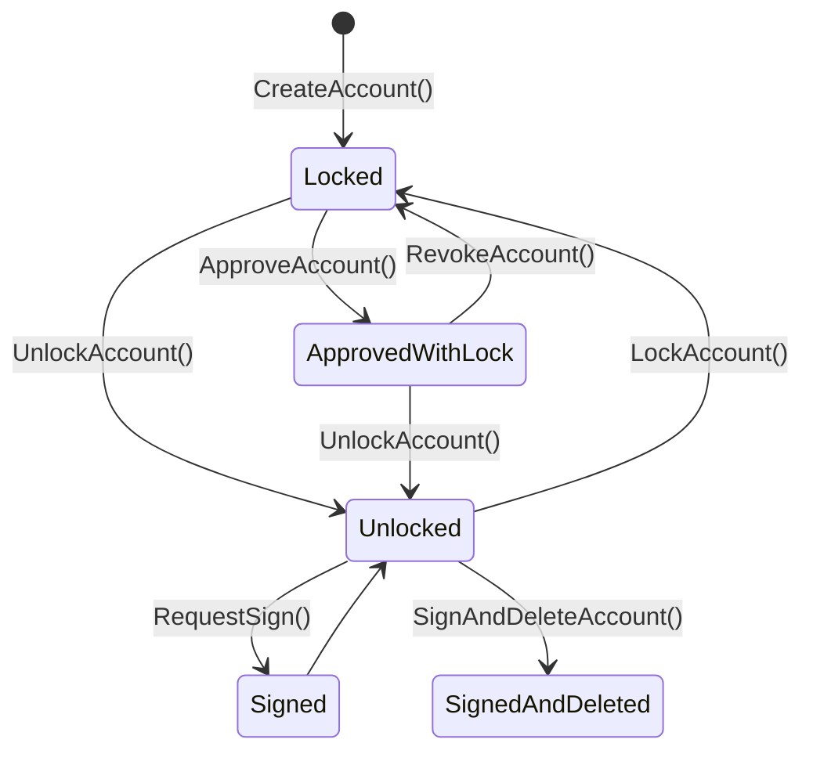

# Astraeus

Astraeus represents the foundational stage of Mycel's architecture, focusing on the implementation of Transferable Accounts. This phase is centered on establishing the core functionality that allows assets to move securely and efficiently across different blockchain platforms.

- Transferable Accounts with SUAVE: In this phase, the Transferable Account system is prototyped and tested within a controlled environment using SUAVE. The goal is to establish a reliable mechanism for moving and managing assets across different blockchain platforms.
- API Specification and Integration: Astraeus also involves defining and refining the API specifications that will allow developers to interact with the Mycel infrastructure. This API will form the backbone of all future development, ensuring that Mycel’s core functionalities are accessible and well-documented.
- Interoperability Testing: During this stage, initial tests are conducted to ensure that Transferable Accounts can operate smoothly across various blockchain platforms, validating the concept of cross-chain asset management.

## State Transition

### `CreateAccount(owner)`

Create a traferable account Returns the public key of transferable account which is created

### `LockAccount(id, duration)`

Lock the transferable account

### `LockAccount(id, duration, to)`

Lock the transferable account and approve unlocking

### `UnlockAccount(id)`

Unlock the transferable account

### `ApproveAccount(id, to)`

Approve unlocking the transferable account to the party

### `RevokeApproval(id, to)`

Revoke the approval to unlocking the transferable account

### `RequestSign(id, data)`

Request a signature of the transferable account

### `RequestSignAndDeleteAccount(id, data)`

Request a signature of the transferable account and delete the key
