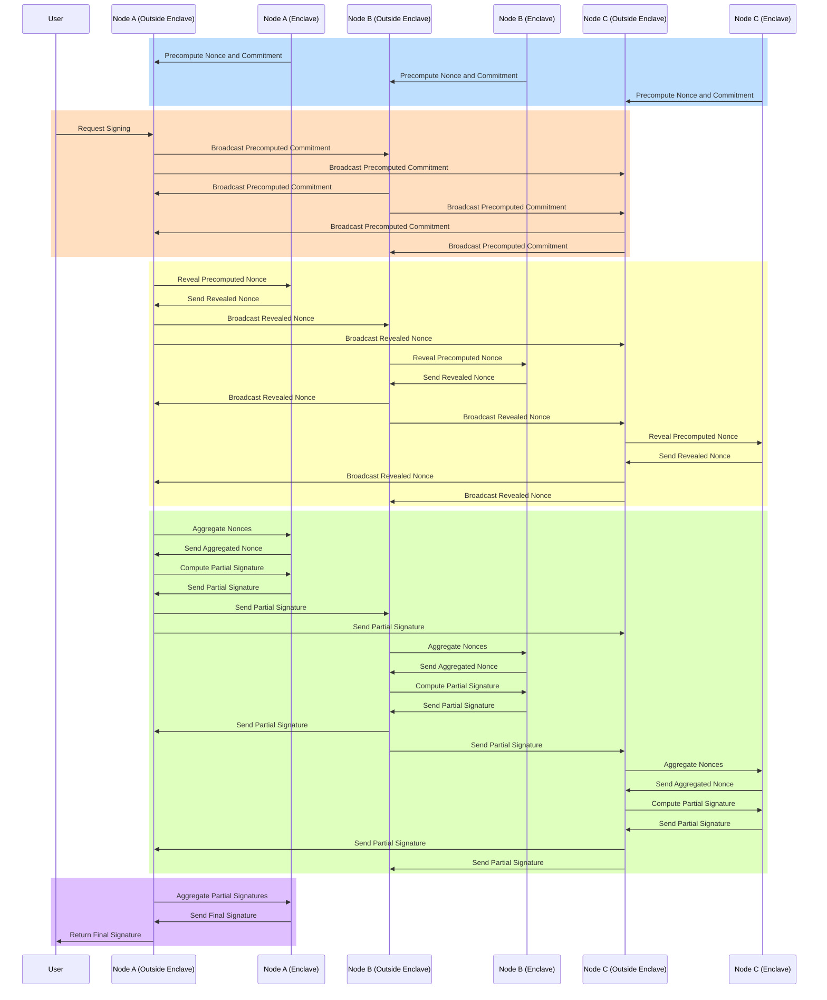

# Cordyceps

Cordyceps builds upon the foundation laid by Astraeus and introduces the concept of Programmable Accounts. This stage is where Mycel’s architecture becomes more advanced, allowing users to define and enforce custom conditions for asset management and transfer.

- Programmable Accounts with TEE Integration: Cordyceps focuses on integrating Trusted Execution Environments (TEEs) with Programmable Accounts. TEEs provide a secure environment within each node where programmable conditions can be executed without exposure to external threats. This ensures that users' custom logic and conditions for asset transfers are enforced securely and reliably.
- Light Client Network: Alongside TEE integration, Cordyceps also implements a Light Client Network that functions like a sidecar to the main blockchain networks. This network allows Mycel to verify transactions and enforce conditions efficiently across multiple blockchains without requiring full node operations, enhancing scalability and reducing resource consumption.
- Advanced Security and Flexibility: By combining the programmability of accounts with the security of TEEs and the efficiency of a Light Client Network, Cordyceps enables users to create highly customized and secure asset management strategies. Whether it’s setting up multi-signature requirements, time-based restrictions, or complex conditional transfers, Cordyceps provides the tools necessary for sophisticated decentralized applications.

## Account Key Generation

In Mycel, each Programmable Account is associated with a unique cryptographic key, referred to as the account key. This key is generated within the secure confines of a Trusted Execution Environment (TEE) on a Mycel node. The TEE ensures that the key generation process is isolated from potential external threats, providing a secure foundation for managing user assets.
Encrypting Account Keys with TSS Keys

Once the account key is generated, it is crucial to protect this key from unauthorized access, particularly when it needs to be shared among different nodes in the network. To achieve this, the account key is encrypted using a Threshold Signature Scheme (TSS) key managed by the Mycel node set.

The encryption process works as follows:

1. Account Key Generation: The account key is generated securely within the enclave.
2. Encryption with TSS Key: The generated account key is then encrypted using a TSS key. This TSS key is a shared key that is distributed among a group of nodes, with the signature generation requiring cooperation from a subset of these nodes (the threshold).
3. Secure Distribution: The encrypted account key is securely distributed among the participating nodes, ensuring that it remains protected during transmission and storage.

### Key Generation

Mycel is a decentralized platform that aims to provide secure and private transactions while maintaining the integrity and verifiability of the system. One of the key components in achieving these goals is the use of threshold signatures, specifically the [Flexible Round-Optimized Schnorr Threshold (FROST) signature scheme](https://eprint.iacr.org/2020/852).

One of the primary reasons Mycel has chosen to employ FROST is its unique property of maintaining a fixed public key, even when the set of signers changes. In Mycel, users' assets are held in transferable account, each associated with a unique public key. The security and ownership of these TAs are distributed among a group of validators using FROST.

## Transfering Process

Programmable Accounts can be transferred or exchanged on any state machine. The Mycel node verifies these transactions and provides users with the necessary signatures. The two primary methods for verification are:

- Light Client Verification
  A light client of the relevant state machine is implemented within the TEE, where it verifies transactions and generates the necessary signatures for the Programmable Account.

- External Prover Verification
  An external prover generates proofs for the transactions, which are then verified within the TEE to ensure the integrity of the Programmable Account’s signature.
  

## Receiving Account/Signature

The process involves four main steps:

1. Receive Signing Data from the User:
   A representative node receives the data that needs to be signed from the user.
2. Collect Signatures Using TSS:
   The representative node initiates a process to collect signatures from the Threshold Signature Scheme (TSS) setup across multiple nodes. Each node contributes its partial signature, which is then aggregated.
3. Decrypt Account Key and Sign Data:
   Once the signatures are collected, the representative node uses these signatures to decrypt the account's private key. The decrypted key is then used to sign the data, which is returned to the user.

### Sequence Diagram

1. Nonce Precomputation (before signing):
   Nonces and their commitments are precomputed and stored within the enclaves of each node, ready for use when a signing request is made.
2. Signing Request and Commitment Broadcast:
   The user initiates the signing process by sending a request. The nodes then broadcast their precomputed commitments to each other to establish the basis for nonce revelation.
3. Reveal Nonces:
   After commitments are received, each node reveals its precomputed nonce. These nonces are then broadcast to other nodes for aggregation.
4. Aggregate Nonces and Generate Partial Signatures:
   Nonces are aggregated inside each node's enclave, and partial signatures are generated using these aggregated nonces and each node's key share.
5. Aggregate Partial Signatures and Finalize:
   The final step involves aggregating the partial signatures within the enclave to produce the final signature, which is then returned to the user.
