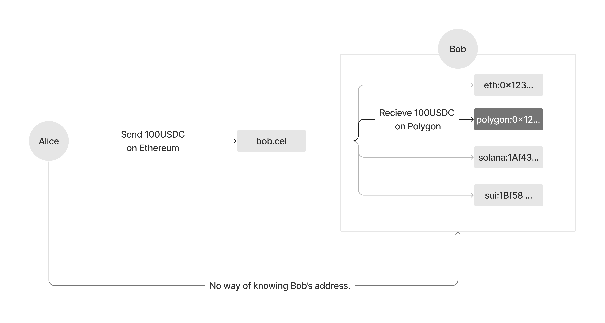
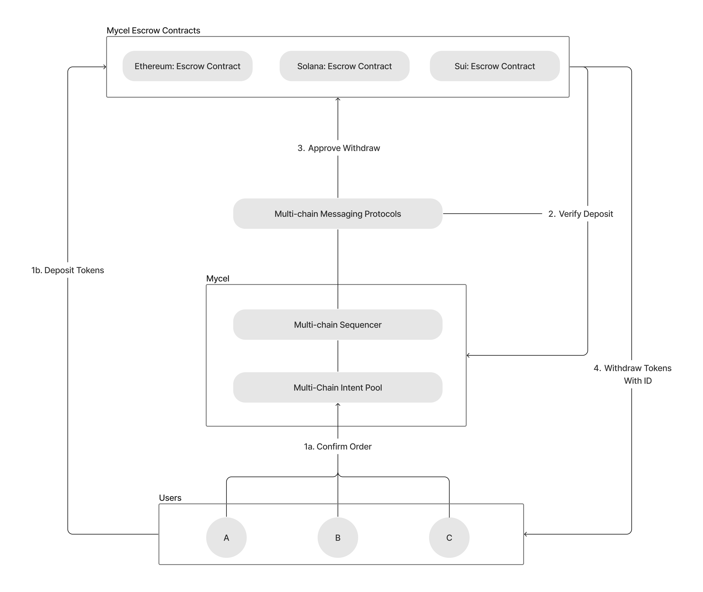

# Concepts

## Mycel ID

Mycel ID is at the heart of the Mycel infrastructure, serving as a unique digital identifier in the multi-chain world, structured in a domain-like format with Top-Level IDs (TLD) and Second-Level IDs (SLD).

Managed on-chain within Mycel's Tendermint-based blockchain, Mycel ID ensures secure, decentralized control over these digital identities. This on-chain management system underscores the platform's commitment to security and decentralization, leveraging the robustness of Tendermint's consensus mechanism. The domain-like format of Mycel ID not only enhances the intuitiveness and memorability of the identities but also mirrors the familiar structure of internet domains, facilitating an easy transition for users.

By merging the convenience of Web2 identity systems with the inherent security and decentralization of Web3, and supporting a variety of authentication methods, Mycel ID offers a seamless bridge to the Web3 space, ensuring users can manage their identities effortlessly and securely across the blockchain landscape.

## ID-based Transfer

The ID-based Transfer feature of Mycel revolutionizes how tokens are transacted in the Web3 space. This feature allows users to send and receive tokens using just IDs, significantly enhancing privacy by keeping actual wallet addresses confidential.

The intent-based sequencer incorporated into Mycel's ID-based Transfer system improves the efficiency and security of transactions. This innovation not only simplifies the transaction process but also enriches the user experience, making Web3 more accessible and user-friendly.
With multi-chain support, users can perform transactions across various blockchain networks, showcasing the flexibility and interoperability of Mycel.

## Multi-chain Intent Pool

The Multi-chain Intent Pool acts as a nexus for user-submitted intents, facilitating a more efficient and direct pathway for executing cross-chain transactions without the need for intermediaries. By collecting intents from users wishing to perform transactions across various blockchains, the pool plays a pivotal role in the intent-resolution process.

