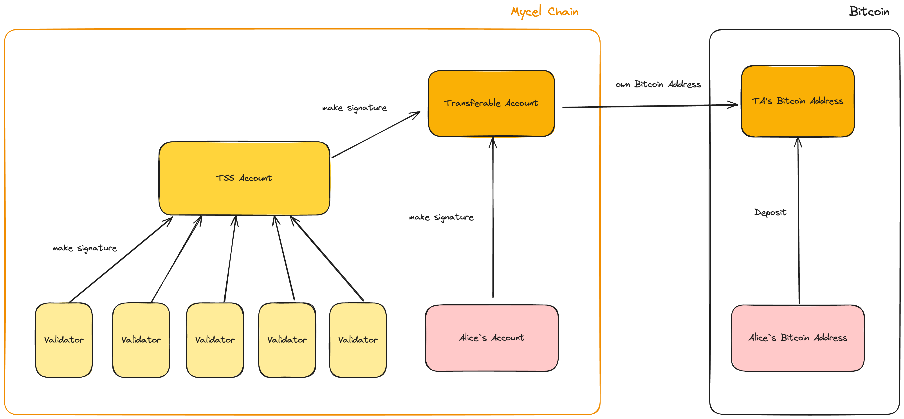
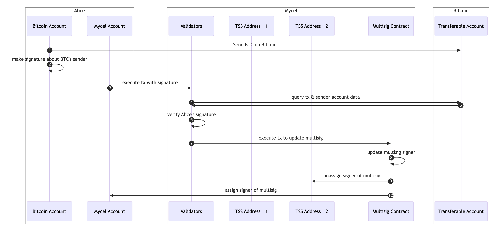
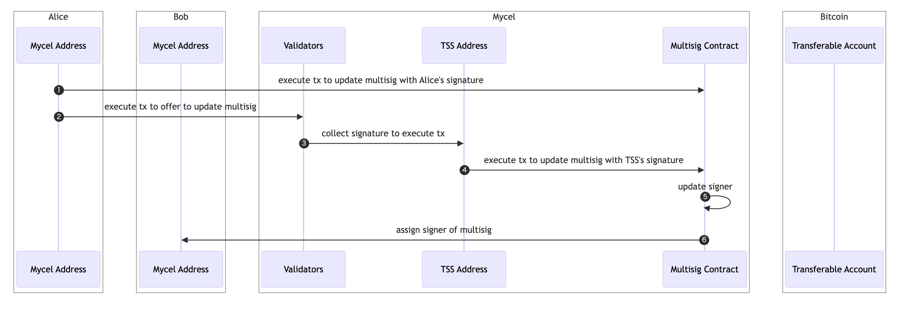
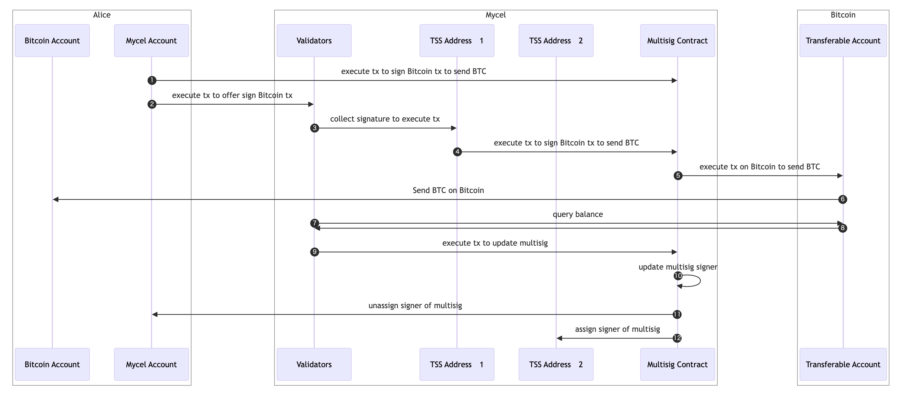

# Transferable Account

## Overview

By utilizing Transferable Accounts, Mycel enables the use of native assets from both account-based chains like Ethereum and UTXO-based chains like Bitcoin. This allows Mycel to extend its capabilities to handle intents for UTXO-based assets such as BTC. Once BTC is deposited into a Transferable Account on Mycel and the required confirmation period has passed, users can instantly send and exchange BTC while retaining ownership control.

A Transferable Account (TA) is a 2-of-2 multi-signature account composed of the user's own account and a Threshold Signature Scheme (TSS) account formed by the validators of the Mycel Chain. A Bitcoin address is created from the public key of this multi-signature account. By depositing BTC to the address of this created account, users can operate the Transferable Account on the Mycel Chain.

Since the TA is a 2-of-2 multi-signature account, it is impossible for the validators of the Mycel Chain to move the user's assets without their consent, ensuring the security of the assets.

## Architecture

A Transferable Account with Bitcoin deposited is structured as follows:

- **Alice**
  - The user who deposits Bitcoin and owns Transferable Accounts on Mycel.
- **TSS Account**
  - accounts on the Mycel Chain operated by validators through threshold signatures. Essentially, two TSS accounts are managed at all times.
- **Transferable Account**
  - An account on the Mycel Chain managed by a 2-of-2 multi-signature, consisting of Alice's account and the TSS Account managed by the validators.

### **Deposit Flow**

Before Alice deposits BTC to the Bitcoin address of the TA, several 2-of-2 Transferable Accounts are prepared using two TSS addresses created by threshold signatures from the validators.

The following flow is executed to enable Alice to deposit BTC and use the Transferable Account on Mycel:

1. **BTC Transfer**

   Alice sends BTC from her account on Bitcoin to the specified Bitcoin TA account.

2. **Signature Creation**

   After completing the transfer, Alice creates a signature using her account on Bitcoin to prove ownership of that account.

3. **Notification**

   Alice uses this signature to notify the specified TA on Mycel that BTC has been transferred.

4. **Deposit Confirmation**

   The validator monitoring Bitcoin on Mycel Chain will see that BTC has been deposited against an account on Bitcoin owned by the TA and the public key of the account that made the deposit.

5. **Verification**

   A validator monitoring Bitcoin on Mycel Chain verifies that BTC has been deposited against TA's account on Bitcoin and that the source is the account designated by Alice, using the signature received from Alice.

6. **TA Signer Update**

   Once the BTC deposit to the TA by Alice is confirmed and a certain confirmation time has passed on Bitcoin, one of the two TSS accounts managing the Transferable Account is removed, and Alice is appointed as a signer in the multi-signature. The Transferable Account is then managed by a 2-of-2 multi-signature with Alice and the TSS address.

   _Note: Validators who do not agree to update the signers will incur penalties._

### **Send Flow**

This flow describes how Alice can transfer the ownership rights of an TA to another user, Bob, within the Mycel Chain.

1. **Specify Recipient**

   Alice specifies Bob's address and executes a transaction (Tx) to remove her signer rights from the TA account and change the signer to Bob. This Tx is executable because Alice is currently the signer of the TA.

2. **Change of Signer**

   Upon execution of the Tx, Alice's signer rights are removed, and Bob becomes one of the new signers.

3. **New Signer**

   Consequently, only Bob can send transactions within Mycel and withdraw BTC from the TA on Bitcoin.

As shown in the sequence diagram, even without directly operating the TA on Bitcoin, Bob holds the ownership rights of the TA and the BTC it possesses.

### **Withdraw Flow**

This flow describes how Alice can withdraw BTC from her TA to another Bitcoin address.

1. **Request Signature**

   Alice executes a transaction (Tx) on the Mycel Chain to request signatures from the validators for the TSS address, including her own signature.

2. **Signature Collection**

   Once signatures from the validators using the TSS address are collected, a signature for the Transferable Account is created.

3. **Create Tx**

   Using Alice's signature and the TSS address signature, a Tx is created to move the assets from the Transferable Account on Bitcoin.

4. **Execute Tx**

   The sequencer within the Mycel Chain executes the Tx on Bitcoin, sending BTC from the TA to the address specified by Alice.

5. **Confirm Withdraw**

   Validators monitoring Bitcoin on the Mycel Chain confirm that the BTC withdrawal from the TA's Bitcoin account is complete.

6. **Remove Alice's Signer Rights**

   Once the transfer is executed and the Mycel Chain confirms there is no remaining balance, Alice's signer rights for the TA are removed, and a new TSS address gains signer rights.

7. **Return to Initial State**

   Similar to before the deposit, the 2-of-2 signers of the TA become two TSS addresses created by the Mycel Chain validators. These TSS addresses are reused for other TA operations.
