# Transferable Account

## Overview

A Transferable Account (TA) on Mycel is a specialized account structure designed to facilitate secure, cross-chain asset management and transfer. It operates using a 2-of-2 multi-signature mechanism, ensuring that both the user and the validators collectively control the account. This design enhances security and decentralization, as no single party can unilaterally control the account or its assets.

**Alice**: A user.  
**TSS Account**: An account operated by validators.  
**Transferable Account**: An account on Mycel managed by a 2-of-2 multi-signature, consisting of Alice and the TSS account.

## Features

### Create Account

Creating a transferable account involves securely linking a user's Bitcoin account to a Mycel account through a series of coordinated actions that ensure the integrity and security of the account creation process. The steps are as follows:

```mermaid
sequenceDiagram
		autonumber
		box Alice
			participant AM as Mycel Account
		end
		box Mycel
			participant V as Validators
        participant TSS1 as TSS Account　1
			participant M as Multisig Contract
		end
		box Bitcoin
			participant TA as Transferable Account
		end
        AM->>V: execute tx with signature
	    V->>V: verify Alice's signature
        V->>M: execute tx to create multisig
        M->>M: create multisig signer
        M->>AM: assign signer of multisig
```

1. Alice initiates a transaction from her Mycel account and signs it.
2. Validators verify Alice's signature to confirm her identity.
3. Validators execute a transaction to update the multisig contract.
4. The multisig contract assigns Alice's Mycel account as a signer.

### Transfer Account

Transferring a Transferable Account from one user (Alice) to another (Bob) involves the following steps:

1. Alice initiates a transaction to update the multisig contract with her signature, indicating her intent to transfer the TA.
2. Validators receive the transaction and collect signatures from the TSS account to authorize the transfer.
3. TSS account signs the transaction and the multisig contract is updated to replace Alice with Bob as the new signer.
4. The multisig contract is updated, making Bob the new authorized signer for the TA.

### Request Signature

Requesting a signature for a transaction (e.g., sending BTC from a Bitcoin account) involves the following steps:

1. Alice initiates a transaction from her Mycel account to sign a Bitcoin transaction to send BTC.
2. Validators receive the transaction and collect signatures from the TSS Address.
3. TSS Address sign the transaction, authorizing the multisig contract to execute the Bitcoin transaction.
4. The transaction is executed on the Bitcoin , and BTC is sent to Alice's Bitcoin account.

### Key Generation

Mycel is a decentralized platform that aims to provide secure and private transactions while maintaining the integrity and verifiability of the system. One of the key components in achieving these goals is the use of threshold signatures, specifically the [Flexible Round-Optimized Schnorr Threshold (FROST) signature scheme](https://eprint.iacr.org/2020/852).

One of the primary reasons Mycel has chosen to employ FROST is its unique property of maintaining a fixed public key, even when the set of signers changes. In Mycel, users' assets are held in transferable account, each associated with a unique public key. The security and ownership of these TAs are distributed among a group of validators using FROST.

## Specification

### State Diagram

### Type

**Account**

- `id` String
- `owner` String
- `curve` Curve
- `publicKey` String
- `approval` Approval
- `lockExpiry` UnixTime

**Approval**

- `publicKey` String
- `curve` Curve

**Curve**

- SECP256K1
- EDCSA

### Messages

`CreateAccount(owner)`

Create a traferable account Returns the public key of transferable account which is created

`LockAccount(id, duration)`

Lock the transferable account

`LockAccount(id, duration, to)`

Lock the transferable account and approve unlocking

`UnlockAccount(id)`

Unlock the transferable account

`ApproveAccount(id, to)`

Approve unlocking the transferable account to the party

`RevokeApproval(id, to)`

Revoke the approval to unlocking the transferable account

`RequestSign(id, data)`

Request a signature of the transferable account

`RequestSignAndDeleteAccount(id, data)`

Request a signature of the transferable account and delete the key

### Query

`GetPublicKey(id)`

Returns the public key (pair) of the transferable account

`GetAddress(id, chain)`

Returns the address of the transferable account

`GetAccountStatus(id)`

returns the status of the transferable account
