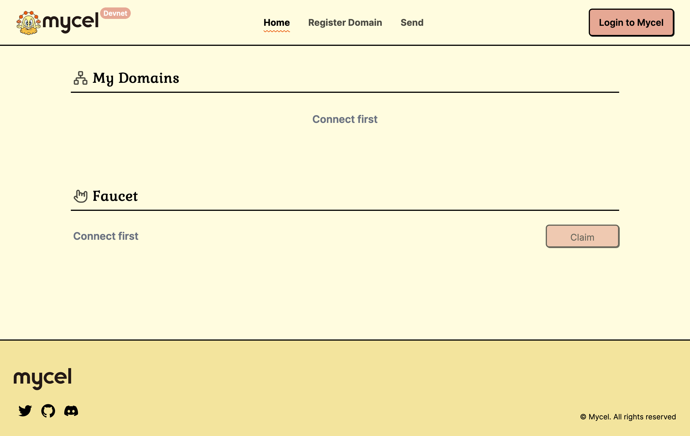
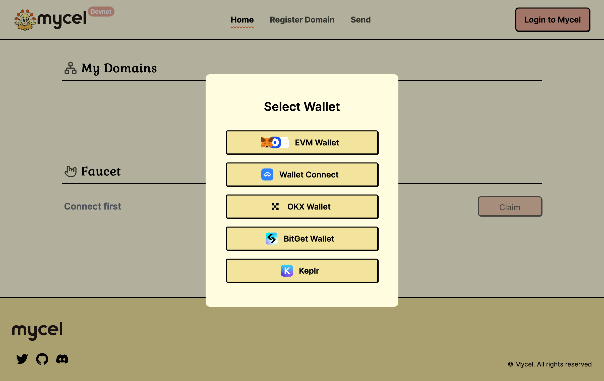
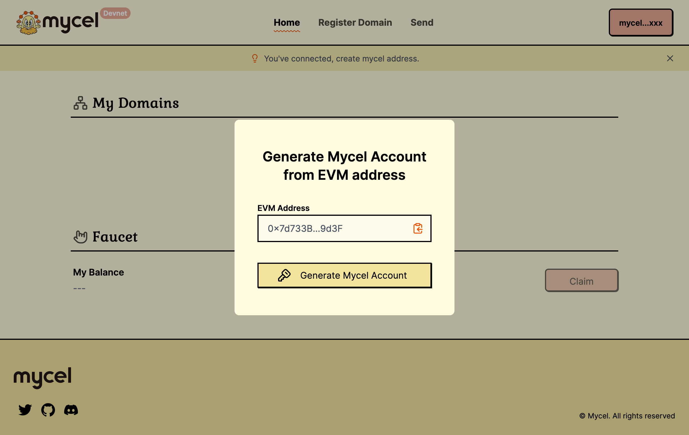
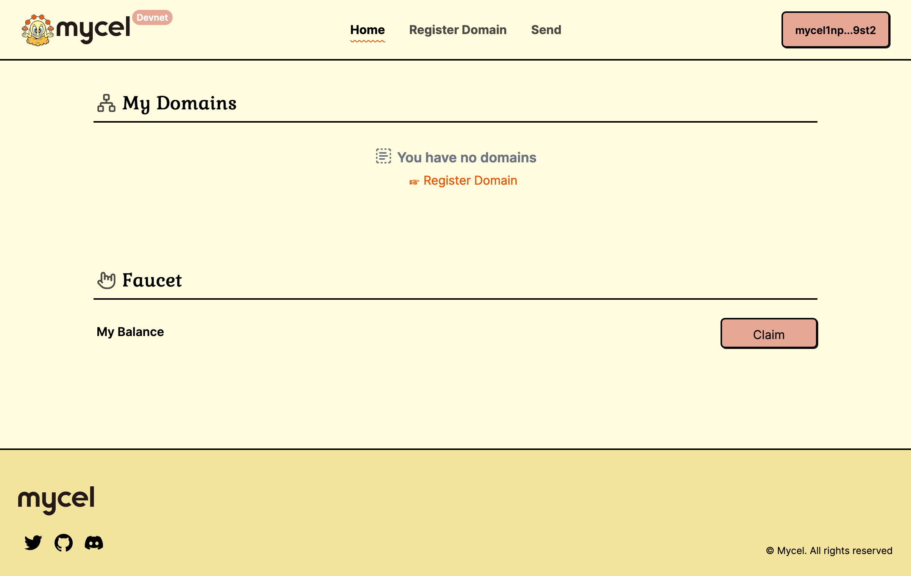
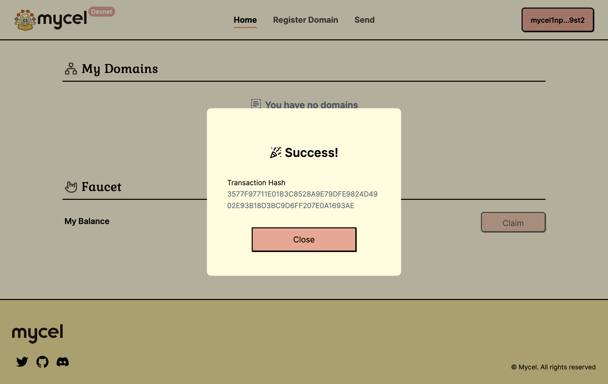
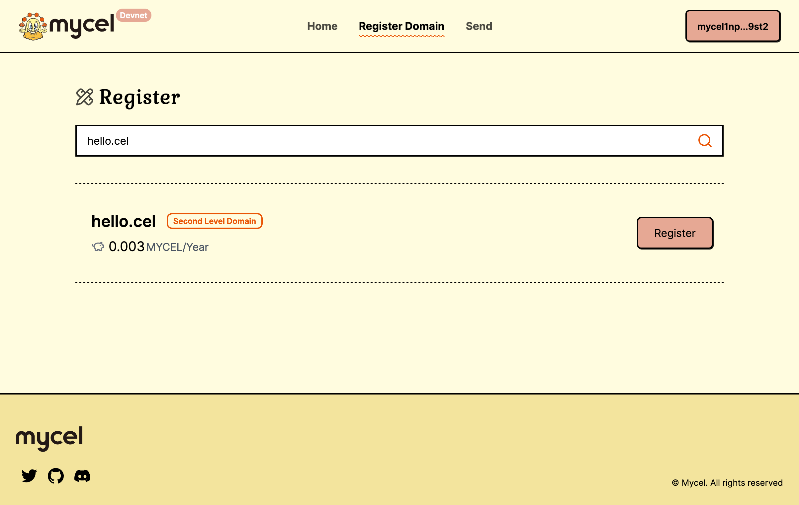
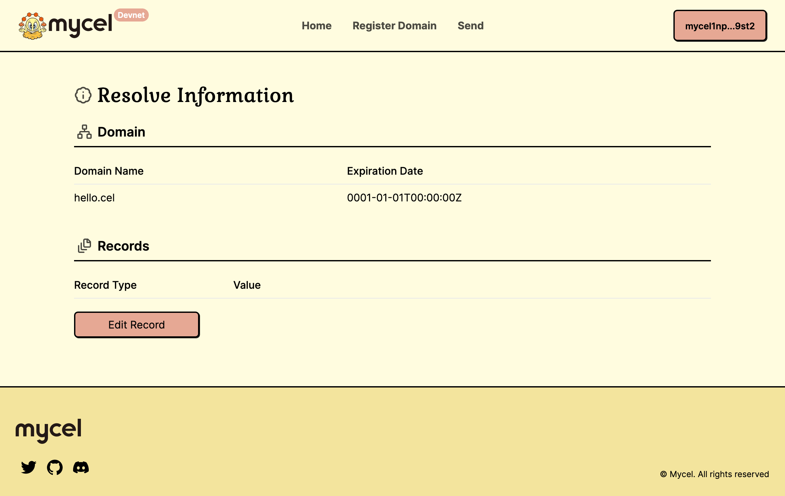
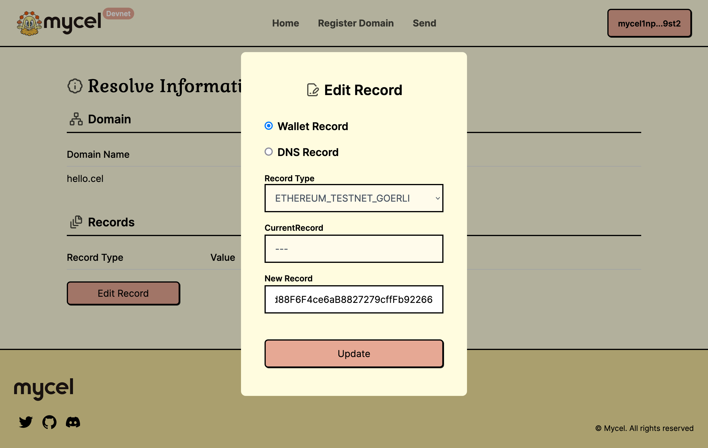

# Register Domain

[https://dashboard.mycel.domains/](https://dashboard.mycel.domains/)

From the Mycel dashboard, you have access to

- Register Domains: Secure your unique digital identity by registering Mycel domains directly from the dashboard.
- Update Records: Keep your domain records up to date with ease, ensuring accurate representation of your digital presence.
- Resolve Domains: Quickly resolve Mycel domains to view associated records or verify ownership.
- Send Tokens with Mycel Domain Name: Simplify transactions by sending tokens to memorable Mycel domain names instead of complex wallet addresses.

## Register domain

### Connect Your Wallet:

Start by logging into Mycel. Click on "Login to Mycel" and connect your wallet.

### Generate Mycel Account (EVM wallet only).

You need to switch network to Ethereum Mainnet before you signing.

### Claim Faucet

Claim faucet from "Claim"

### Register Domain

Go to the "Register Domain" tab and enter the domain name you wish to register.

### Edit Wallet Record

After registration, you can edit your wallet record by visiting the "Edit Record" page.

### Send Token

Go to "Send" Tab, you can send token via domain name.

