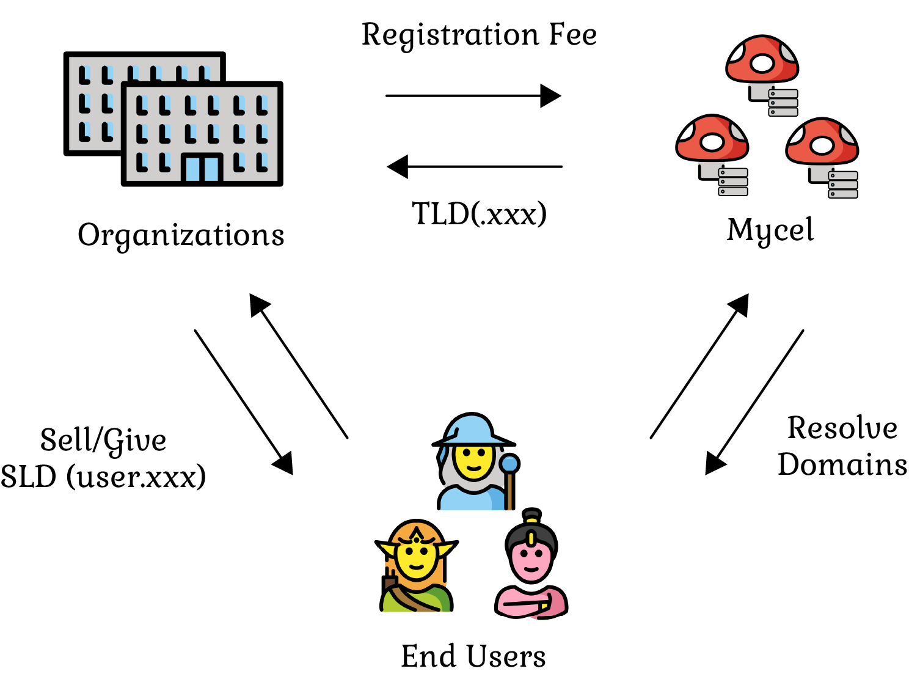

# Domain Registration

Domain registration is a crucial aspect of the Mycel project.
It provides users with the ability to secure unique domain names that can be used to represent their websites, services, or digital assets on the decentralized web. The Mycel domain registration process consists of two levels: Top-Level Domains (TLDs) and Second-Level Domains (SLDs). Here, we will delve into the details of each level and the registration process.

## Top-Level Domains (TLDs)

TLDs are the highest level in the domain name hierarchy, such as .com, .org, or .net. In Mycel, validators are responsible for registering TLDs.
The process of issuing a TLD within the Mycel system involves several key steps:

1. The TLD applicant must pay a registration fee in tokens (such as USDC) equivalent to the desired number of accounts per year multiplied by a specific rate.
2. Locking of Registration Fee: The paid registration fee is then locked within the Mycel system.
3. Mycel calculates the amount of MYCEL tokens to burn based on the locked registration fee and a specific rate. The tokens are then burnt, effectively removing them from circulation.
4. Upon successful completion of the above steps, Mycel issues the TLD to the applicant.

## Second-Level Domains (SLDs)

SLDs are the domain names that users typically register and use for their projects, such as example.com or myproject.org. In the context of Mycel, the primary SLD is .cel (e.g., myproject.cel). Users can register SLDs under the .cel TLD to represent their projects or assets in the decentralized ecosystem.

The registration fee for SLDs depends on the number of characters in the domain name.
This variable pricing structure incentivizes users to select shorter domain names, which are generally more memorable and valuable.

## Subdomains

Subdomains are subdivisions of SLDs, allowing users to create additional levels within their registered domain names. For example, a user with the domain myproject.cel could create a subdomain like blog.myproject.cel. In Mycel, subdomain registration is free of charge, enabling users to create as many subdomains as they need without incurring additional costs.

## Domain Registration Process

To register a domain in Mycel, users must follow these steps:

1. Choose a unique SLD that is not already registered. The SLD should be concise, memorable, and representative of the user's project or asset.
2. Calculate the registration fee based on the number of characters in the chosen SLD.
3. Connect a supported wallet (e.g., Kepler or MetaMask) with sufficient funds to cover the registration fee.
4. Submit a domain registration request through the Mycel platform. The request will be processed, and if successful, the domain will be registered to the user's wallet address.
5. Optionally, users can create subdomains for their registered SLDs free of charge.

By providing a decentralized domain registration system with a user-friendly process, Mycel enables users to secure unique domain names for their projects and assets in the decentralized web.
