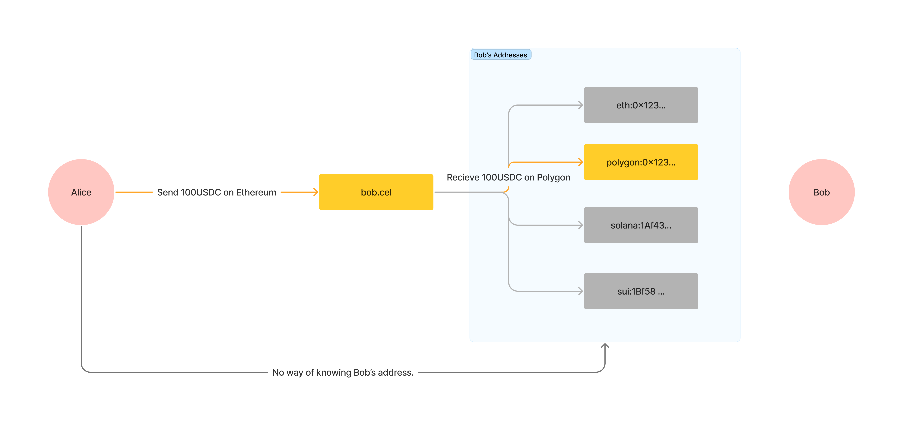

# Domain-based Transfer

The Domain-based Transfer feature of Mycel revolutionizes how tokens are transacted in the Web3 space. This feature allows users to send and receive tokens using just domain names, significantly enhancing privacy by keeping actual wallet addresses confidential.
The intent-based sequencer incorporated into Mycel's Domain-based Transfer system improves the efficiency and security of transactions. This innovation not only simplifies the transaction process but also enriches the user experience, making Web3 more accessible and user-friendly.
With multi-chain support, users can perform transactions across various blockchain networks, showcasing the flexibility and interoperability of Mycel.
