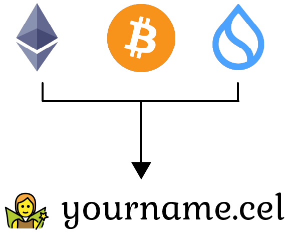
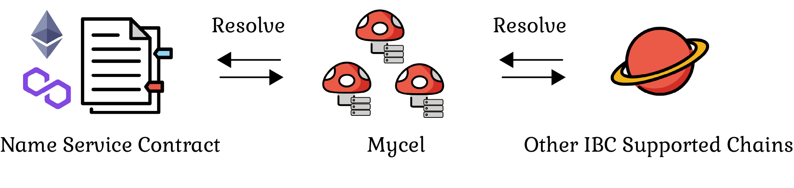

# Mycel ID

Mycel ID is at the heart of the Mycel infrastructure, serving as a unique digital identifier in the Web3 world.
It enables users to register and manage their Web3 identities effortlessly, merging the convenience of Web2 identity systems with the security and decentralization of Web3.
Mycel ID supports various authentication methods, including biometric (fingerprint) and traditional methods (Google, Email, etc.), ensuring that users have a smooth transition to and interaction within the Web3 space. With its integration of off-chain and on-chain elements and native DNS support, Mycel ID lays the foundation for a decentralized, yet user-friendly platform that harmonizes the best aspects of Web2 and Web3 technologies.

### Customizable Domains

Mycel offers a tiered domain registration system including Top-Level Domains (TLDs), Second-Level Domains (SLDs).
This system is attractive to organizations with communities seeking more flexible and customizable naming services.
[See more](./domain-registration)

### Interoperability

Mycel supports communicate with other blockchain network like:

- Ethereum and other EVM compatible chains
- IBC Supported chains

It possible to register and resolve domains, and update records from various blockchain network.

And this enables seamless integration with various name services:

- Ethereum Name Service (ENS)
- Inter-Chain Name Service (ICNS)  
  ...

This integration can increase utility for users who have existing domains on those services or want to access features provided by them

Also, Mycel supports almost of all chain's wallet addresses.
It is possible to resolve multiple addresses for each chain, such as contract wallets, with a single name.

### Multiple Protocols Support

Mycel caters to different user needs by supporting various protocols and a range of record types.
Supported record types:

- Domain Name System (DNS) records
- Wallet addresses
- IPFS addresses
- Metadata records, which can store any custom data

And, you can resolve domains via the following protocols:

- Domain Name Service (DNS)
- Inter‑Blockchain Communication Protocol (IBC)
- Name Service Contract(EVM)
- RPC

You will be able to manage complex addresses with one domain.
This means that it is possible to track multiple chains of activity under one domain.
[See more](./name-resolution)
