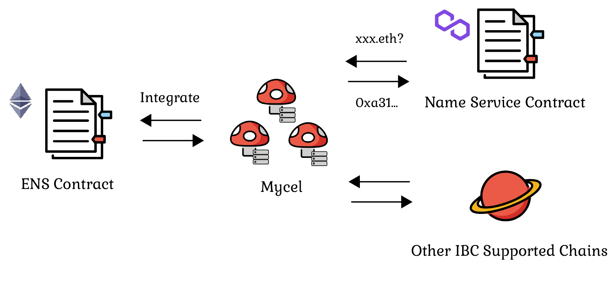

# Introduction

## What is Mycel?

Mycel is a Decentralized ID Infrastructure solution that resolves addresses such as websites, crypto wallets, IPFS, among many more accessible through a single domain with name resolution support in DNS, IBC and smart contracts.

Existing name service are operated as dApps on each chain, but they lack interoperability with other chains and managed by single govenance entity on each chain.  
Our motivation is to build a "Domain Management Ecosystem" that manages domains on a decentralized network aimed at name resolution, making them accessible from multiple protocols to solve these problems.
This project aims to expand the ecosystem by integrating existing name services, adopting common token standards (ERC721, ADR43), and messaging protocols for interoperability (e.g., IBC) to improve utility and liquidity.

## Why Mycel?

### Customizable Domains

Mycel offers a tiered domain registration system including Top-Level Domains (TLDs), Second-Level Domains (SLDs).
This system is attractive to organizations with communities seeking more flexible and customizable naming services.
[See more](/overview/domain-registration)

### Interoperability

Mycel supports communicate with other blockchain network like:

- Ethereum and other EVM compatible chains
- IBC Supported chains

It possible to register and resolve domains, and update records from various blockchain network.

And this enables seamless integration with various name services:

- Ethereum Name Service (ENS)
- Inter-Chain Name Service (ICNS)  
  ...

This integration can increase utility for users who have existing domains on those services or want to access features provided by them

Also, Mycel supports almost of all chain's wallet addresses.
It is possible to resolve multiple addresses for each chain, such as contract wallets, with a single name.

### Private records

Mycel's 'Private Record' feature ensures that users can send and receive tokens using just a domain name, without revealing their actual wallet address. This is achieved using a cryptographic technique called zero-knowledge proof.  
In essence, zero-knowledge proof allow one party to prove to another that a statement is true, without revealing any specific information about the statement itself. By leveraging this technology, Mycel ensures that transactions remain both private and secure, offering users peace of mind and enhanced protection.

### Integration with Other Name services

It is also integrated with other blockchain name services such as [Ethereum Name Service (ENS)](https://ens.domains).
For example, by connecting your ENS domain to Mycel, you can resolve your ENS domain (not only Ethereum addresses, but also Bitcoin, Cosmos, Aptos, and more) from other supported chains, or resolve your website by adding DNS records.

### Multiple Protocols Support

Mycel caters to different user needs by supporting various protocols and a range of record types.
Supported record types:

- Domain Name System (DNS) records
- Wallet addresses
- IPFS addresses
- Metadata records, which can store any custom data

And, you can resolve domains via the following protocols:

- Domain Name Service (DNS)
- Inter‑Blockchain Communication Protocol (IBC)
- Name Service Contract(EVM)
- RPC

You will be able to manage complex addresses with one domain.
This means that it is possible to track multiple chains of activity under one domain.
[See more](/overview/name-resolution)

### Incentives and Governance for Participation

Mycel's platform aims to create a decentralized and fair ecosystem for domain name registration and management. Instead of distributing domain registration fees directly, Mycel burns a calculated amount of MYCEL tokens, using this mechanism to compensate Validators and other network participants for their contribution to maintaining the network's security and stability.
[See more](/overview/tokenomics)

### Smart Contracts

You can build and deploy dApps(CosmWasm smart contracts) on Mycel like:

- Community Management Tools
- Decentralized Identifiers(DID) Protocols
- Decentralized Exchanges  
  ...
