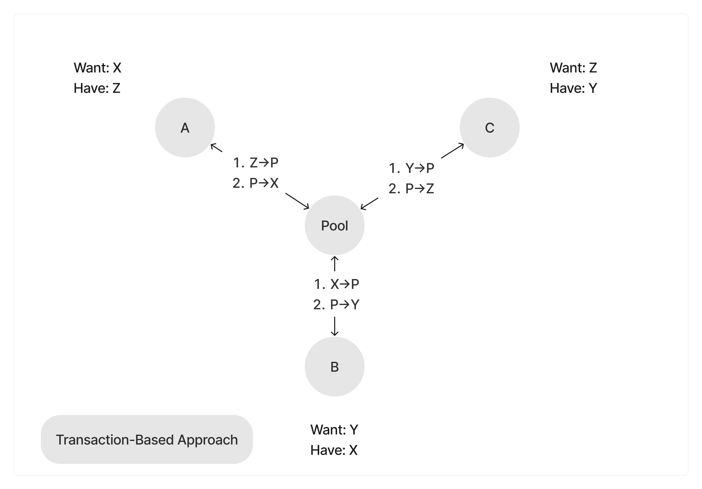
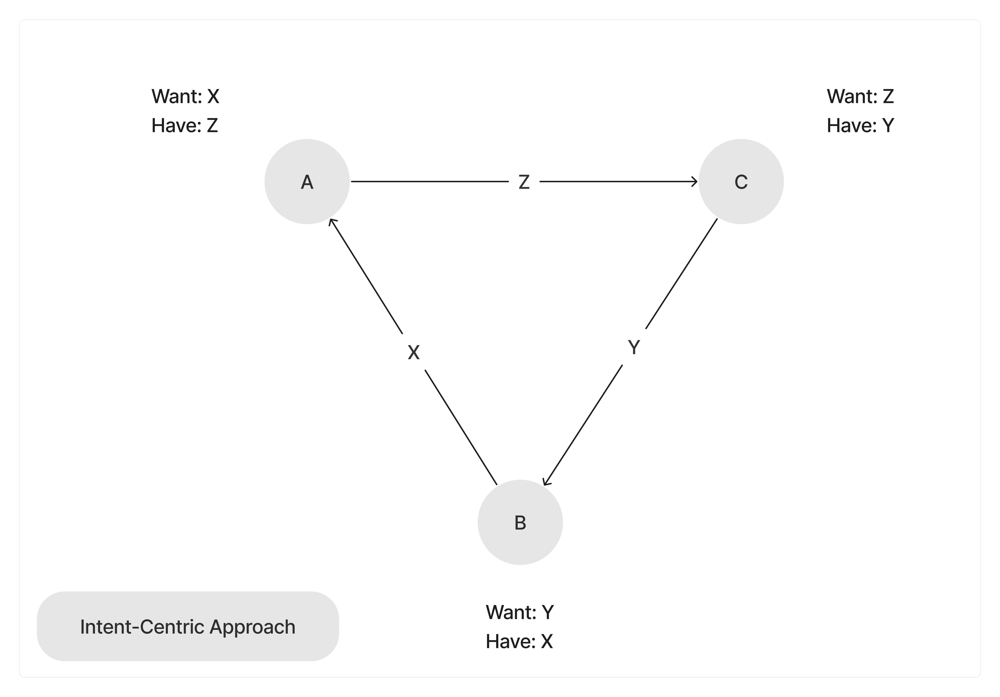

# Introduction

## What is Mycel?

Mycel is an intent-centric interface to solve complexity in multi-chain and bring bilion users for Web3 by eliminating the need for them to understand complex blockchain concepts like gas fees and transactions.

By adopting Mycel's intent-centric interface, protocols like Restaking Protocols and Decentralized Exchanges (DEX) can provide a user-friendly experience, where actions are reduced to simple intents that hide the complex details of blockchain operations.
This approach enables a broader range of applications to become more user-friendly, inviting a vast new audience to explore.

## What is Intent?

In the context of software and blockchain technologies, an "intent" refers to a user's declared goal or desired outcome without specifying the procedural steps needed to achieve that outcome. It's a high-level declaration of what the user wants to do, such as sending tokens to someone, purchasing an item, or accessing a service. The concept of intent abstracts away the complexity of the operations required to fulfill these desires, focusing instead on the end result that the user wants to achieve.

Let's break down the scenario step by step for both the transaction-based approach and the intent-centric approach, using the example where Person A wants Z token, Person B wants X token, and Person C wants Y token.

**Transaction-Based Approach**:

1. Deposit Tokens into Pool:

   - A deposits X token into a pool and receives P token.
   - B deposits Y token into the same pool and receives P token.
   - C deposits Z token into the pool and receives P token.

2. Exchange P Tokens for Desired Tokens:

   - A uses P token to acquire Z token from the pool.
   - B exchanges P token for X token.
   - C exchanges P token for Y token.

3. Withdrawal:
   Each participant withdraws their desired tokens from the pool, completing the exchange process.

This approach requires all parties to first convert their tokens into a common intermediary (P token) before trading for their desired tokens, potentially incurring multiple transaction fees and slippage.

**Intent-Centric Approach**:

1. Expressing Intents:

   - A declares the intent to swap X token for Z token.
   - B declares the intent to swap Y token for X token.
   - C declares the intent to swap Z token for Y token.

2. Intent Matching and Execution:

   - The platform automatically identifies the cyclical match among the intents of A, B, and C.
   - Instead of converting tokens into a common intermediary, The platform orchestrates a direct swap based on the declared intents.

3. Direct Swap:
   - A directly receives Z token in exchange for X token.
   - B directly receives X token in exchange for Y token.
   - C directly receives Y token in exchange for Z token.

The intent-centric approach simplifies the process by directly matching the intents of participants in a circular manner, eliminating the need for an intermediary token and reducing the associated costs and complexity. This method allows for a more efficient and straightforward exchange, closely aligning with the users' initial desires and intentions.

## What is an Intent-Centric Interface?

An intent-centric interface, as exemplified by Mycel, is a design paradigm that prioritizes these user intents in the interaction model. Instead of requiring users to understand and navigate the complex processes underlying their actions (such as blockchain transactions), an intent-centric interface allows users to simply state their "intent" and relies on the system to figure out how to execute it. This approach significantly simplifies the user experience, making technology like blockchain more accessible and user-friendly.
How Mycel Implements an Intent-Centric Interface

Mycel leverages the intent-centric model to enhance interactions within the blockchain ecosystem, particularly focusing on identity and transaction management. Here’s how Mycel embodies this approach:

- **Simplified Digital Identity**: Mycel facilitates the creation of multi-chain wallets using familiar authentication methods such as biometric identifiers or Google Authentication. By simply expressing the intent to create a multi-chain wallet linked to their Mycel ID, users can effortlessly initiate the process. Mycel then automates the intricate steps involved, from generating the wallet to securely associating it with the user's digital identity across various blockchain networks.

- **ID-Based Transfer**: Mycel allows users to perform transactions using domain names instead of complex blockchain addresses. Users express an intent like “send tokens to domain.name,” and Mycel handles the resolution and execution of these transactions, abstracting away the technicalities.

- **Multi-Chain Operations**: By supporting intents that span across multiple blockchains, Mycel facilitates a seamless experience for users wanting to interact with different blockchain ecosystems without worrying about the specifics of each chain.
