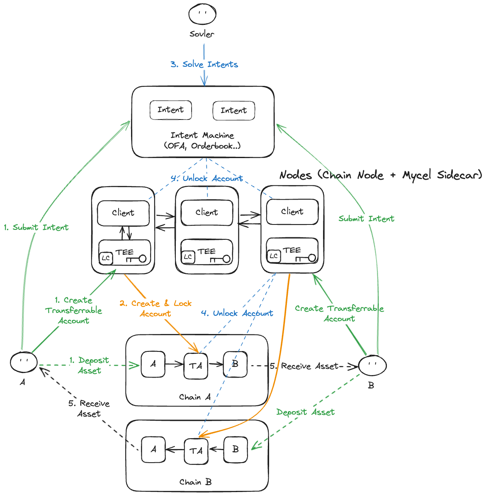

# Introduction of Mycel

Mycel is a decentralized infrastructure designed to synchronize state machines across a diverse array of blockchain platforms. In essence, blockchains can be viewed as distributed state machines, where the state evolves as a result of transactions and smart contract executions. Mycel leverages this understanding to create a unified system that enables seamless interaction between these state machines, allowing assets and data to flow freely across different blockchains.

At the core of Mycel's innovation is the concept of **Transferable Accounts**, which enable users to move, manage, and trade assets across multiple blockchains while retaining complete control over their accounts. In the fragmented blockchain ecosystem, where each chain operates as its own state machine with unique rules and constraints, interoperability is often limited and complex. Mycel addresses this challenge by providing a solution that facilitates cross-chain asset transfers with minimal friction, making it easier for users to interact with different blockchains as if they were part of a single, cohesive system.

Building on this foundation, Mycel introduces the **Programmable Account**, a more advanced and flexible version of the Transferable Account. Unlike traditional blockchain accounts, which operate under fixed, predefined rules, Programmable Accounts allow users to define custom conditions and programmable logic that govern how and when their assets can be signed or transferred. These conditions might include multi-signature requirements, time-based restrictions, or complex logic involving external data sources like oracles. This programmability extends the functionality of accounts beyond simple transfers, enabling more sophisticated use cases such as automated financial contracts, decentralized governance, and secure, conditional asset management.

Mycel is not merely a tool for managing blockchain assets—it is a comprehensive infrastructure that harmonizes the interactions between blockchain state machines. By providing users and developers with powerful tools like Transferable and Programmable Accounts, supported by strong cryptographic foundations and secure execution environments, Mycel empowers a new level of control and flexibility in the decentralized ecosystem. Whether you are a developer building cross-chain applications, a business integrating blockchain solutions, or a user managing diverse digital assets, Mycel offers the infrastructure to make decentralized interactions as seamless, secure, and powerful as possible.
