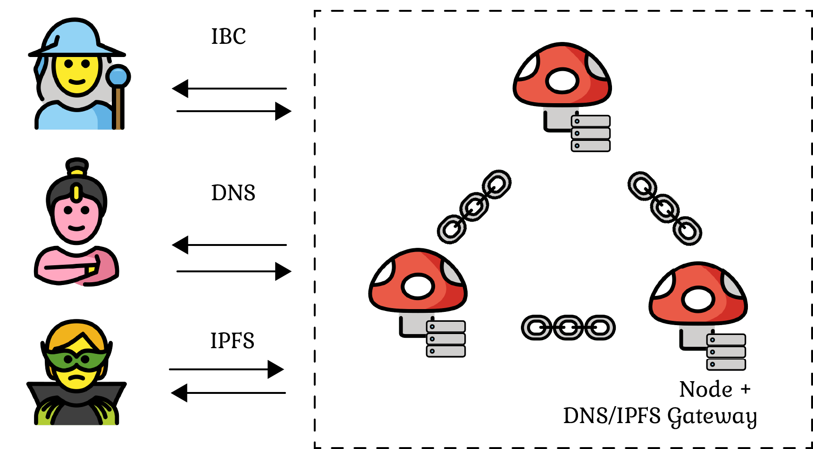

# Name Resolution

One of the key features of Mycel is its domain name resolution system, which allows users to resolve domain names through various protocols, such as DNS, smart contracts, and RPC.
This document provides an overview of the domain name resolution process in Mycel and its supported protocols.

## Support Protocols

### DNS

Each node within the Mycel network provides a DNS server to facilitate domain name resolution. This enables users to resolve Mycel domain names using traditional DNS clients and applications, providing a seamless experience for those transitioning from the centralized web to the decentralized ecosystem.

### Smart Contracts

Mycel's Name Service Contracts (NSCs) are deployed on supported blockchain networks, such as EVM-compatible chains. Users can interact with NSCs to resolve domain names from within their smart contracts.

1. Users can call the `resolve()` function on an NSC from their smart contract.
2. The NSC emits an `onRequest` event upon receiving the resolve request.
3. The Mycel network listens for `onRequest` events and processes the resolution requests.
4. The Mycel network sends the resolution response to the NSC.
5. The NSC calls back the user's smart contract with the resolved data.

### RPC

Mycel also supports domain name resolution through Remote Procedure Calls (RPC), which allows users to resolve domain names programmatically using various programming languages and frameworks.
