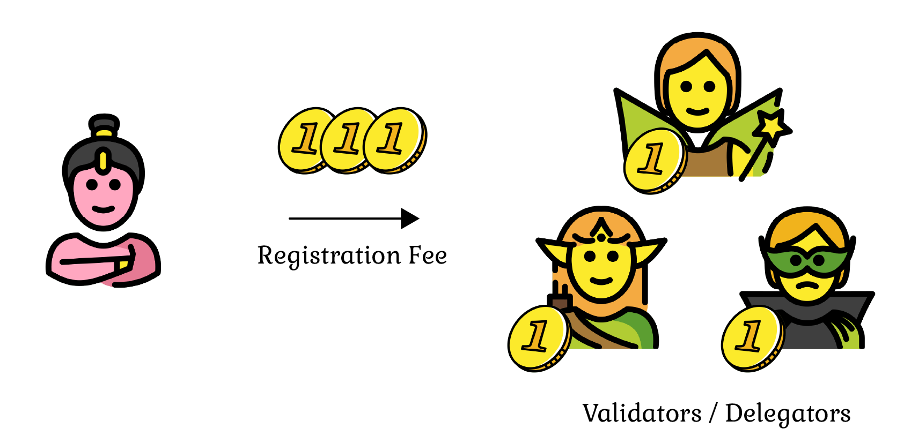

# Tokenomics

Mycel is driven by the belief that:

- Domain registration fees should be dedicated to domain management expenses.
- Interoperable domains should be managed not by a single governance entity but by a governance structure formed by the network that manages the domains.

Mycel's platform aims to create a decentralized and fair ecosystem for domain name registration and management. Instead of distributing domain registration fees directly, Mycel burns a calculated amount of MYCEL tokens, using this mechanism to compensate Validators and other network participants for their contribution to maintaining the network's security and stability.

## Network Participants and Their Functions

### Domain Registrant

In the Mycel project, the process of domain name registration is centrally governed by MYCEL tokens. Initially, the registration fee is paid using tokens (e.g., USDC), which are temporarily stored within the Mycel system. Subsequently, based on a predetermined rate, the quantity of MYCEL tokens to be burned is calculated from the locked registration fee, and said tokens are burned, thus removing them from circulation. This approach strategically provides rewards to validators and other network participants without directly allocating the domain registration fees. The act of burning MYCEL tokens contributes to a reduction in token supply, adjustment of its value, and sustenance of the network's security and stability.

### Validator

Validators constitute a pivotal part of Mycel, with numerous advantages and incentives being provided. In the following, we elucidate how validators procure rewards, the incentives in place for maintaining network security and stability, the specific role validators play within the network, and the impact thereof on the token economics.

Becoming a validator? [Read here](/validate)

#### Rewards and Incentives:

1. **Earning Rewards**
   Validators are rewarded with MYCEL tokens for committing new blocks and storing data, the reward being calculated as a specified percentage of the total stake. Additionally, they receive transaction fees as rewards for processing transactions.
   Validators may have the option to set a commission rate on the rewards that are distributed to their delegators. This commission is meant to cover the operational expenses of running a validator node and to compensate for the validator's services.
   The commission structure and rates can be determined by the validator within the parameters set by the network governance. Validators should transparently communicate their commission rates to their delegators, ensuring that there is clarity and understanding about the reward distribution.
2. **Governance**
   Validators engage in discussions regarding network rules and policies, participate in voting, and collaboratively shape the network's governance with the community. As token holders, validators vote on governance proposals, collectively determining the network's direction. The token economics facilitates incentives to validators through allocation of voting rights and a reward system, thereby enhancing the network's safety and efficiency. This structure motivates validators to maintain the network's integrity and to actively engage in the governance process.

### Delegator

By delegating tokens to validators, delegators augment network governance and security, and in turn, earn rewards. However, this process encompasses risks, necessitating prudent selection and management of validator delegation.

#### Rewards and Risks:

1. **Rewards:** Validators authenticate blocks and allocate a portion of their rewards to delegators. The rewards for delegators are proportional to the amount of tokens delegated, enabling delegators to receive regular staking rewards through delegation.
2. **Risks:** The selection of a validator is pivotal as voting for dishonest validators could incur penalties. In instances where delegators vote for a validator exhibiting dishonest behavior, they could face penalties and potentially lose their delegated tokens. It is imperative to choose efficient and trustworthy validators to minimize risks and maximize rewards. Delegators bear the responsibility of meticulously selecting validators, which in turn enhances network governance and security, with their choice of validator directly impacting their rewards and risks.

## Token Burning Process

1. **Calculate the Total Domain Registration Fees**: Determine the total amount of domain registration fees collected during the period in accepted tokens (e.g., USDC).
2. **Determine the Amount of MYCEL to Burn**: Calculate the amount of MYCEL tokens to burn using the collected fees and a specific rate, which considers factors including the price of MYCEL in accepted tokens, the staking rate, the inflation rate, and other set parameters. Concurrently, determine the token amounts to allocate to the community pool.
3. **Burn the MYCEL Tokens**: Execute the burning process, removing the calculated MYCEL tokens from circulation. The amount burned translates into compensation for Validators, incentivizing them to operate nodes and contribute to the network.

## Burn Mechanism

$B$ : Amount of MYCEL to burn  
$X$: Amount of token (e.g., USDC) required for registration fee  
$P$: Price of MYCEL in token X  
$S$: Rate of staking, representing the proportion of tokens that are staked in the system  
$I$: Rate of inflation, indicating the yearly increase in the total supply of tokens  
$\alpha$: A parameter, ranging from 0 to 1, used to balance the influence of staking and inflation

### Calculating the Burn Amount

The weight is determined using the equation:

$$
W= \alpha S+(1-\alpha)I
$$

This equation calculates the weight $w$ that takes into account both the rate of staking $S$ and the rate of inflation $I$. The parameter $\alpha$ is used to determine the relative importance of staking versus inflation in the weight.

The amount of MYCEL tokens to be burned is calculated using the equation:

$$
B=\frac{WX}{P}
$$

This equation calculates the amount of MYCEL tokens to burn ($B$) for a given registration fee in tokens $X$.

The burn amount is inversely proportional to the product of the weight $w$ and the price of MYCEL in tokens $P$. Therefore, if the weight is high due to higher staking or inflation, fewer MYCEL tokens will be burned for the same registration fee.

### Calculating the Non-Burned Token Amount

The non-burned token amount is calculated using the equation:
$$Y=(1−W)X$$

This equation calculates the amount of token ($Y$) that is not burned and instead kept in the community pool. The weight $W$ is calculated as $W = \alpha \cdot S + (1 - \alpha) \cdot I$, taking into account both the rate of staking $S$ and the rate of inflation $I$. The parameter $\alpha$ is used to determine the relative importance of staking versus inflation in the weight.

The non-burned token amount is directly proportional to the registration fee in tokens $X$ and inversely proportional to the weight $W$. Therefore, if the weight is high due to higher staking or inflation, a smaller portion of the registration fee will be kept as non-burned token in the community pool.
