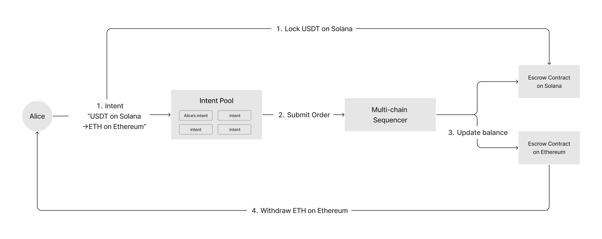
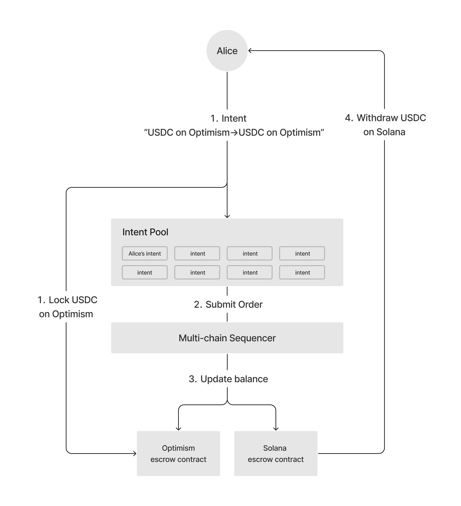

# Cross-chain Gas-free Swap and Bridge

Mycel has some convenient usecases for next billion users. Cross-chain Gas-free Swap and Bridge with simple interface allow to bring them for Intent Centric approach.

- Cross-chain Swap / Bridge: Users can swap and bridge with cross-chain like from Solana to Ethereum, Sui to Solana and Optimism to Solana
- Gas-free Swap / Bridge: Allow swap and bridge to users without using native token.
- Mycel ID: Mycel ID makes cross-chain swap/bridge easy with Intent Centric Interface

## Usecase 1-1: Alice wants to Swap USDT on Solana to ETH on Ethereum without native tokens

1. **Intent Declaration**: Alice uses the Mycel interface to declare her intent to swap USDT on Solana for ETH on Ethereum, opting to pay the service fee with USDT, thus avoiding the need for native gas tokens(SOL).
2. **Intent Submission and Matching**: Her intent is submitted to the Multi-chain Intent Pool on Mycel, where Mycel's sophisticated algorithms identify a matching intent from Intent pool on Mycel or other intent pool like UniswapX that complements Alice's swap requirements.
3. **Sequencer and Escrow Interaction**: The Mycel sequencer orchestrates the transaction, interfacing with escrow mechanisms on both Solana and Ethereum. It locks Alice's USDT in an Solana-based escrow and signals a Ethereum escrow to prepare for delivering the swapped tokens.
4. **Withdraw Token**: Alice Withdraw ETH on Ethereum.

## Usecase 1-2: Bob wants to Bridge USDC on Optimism to Solana in best rate without native token

1. **Intent Declaration**: Bob uses the Mycel interface to declare his intent to bridge USDC on Optimism for USDC on Solana, opting to pay the service fee with USDC, thus avoiding the need for native gas tokens(OP).
2. **Intent Submission and Matching**: His intent is submitted to the Multi-chain Intent Pool on Mycel, where Mycel's sophisticated algorithms identify a matching intent from Intent pool on Mycel or other intent pool that complements Bob's swap requirements.
3. **Sequencer and Escrow Interaction**: The Mycel sequencer orchestrates the transaction, interfacing with escrow mechanisms on both Optimism and Solana. It locks Bob's USDC in an Optimism escrow and signals a Solana-based escrow to prepare for delivering the bridging tokens.
4. **Withdraw Bridged Token**: Bob Withdraw USDC on Solana.

## Supported Chains (Upcoming)

- Ethereum
- Polygon
- Arbitrum
- Optimism
- BNB Chain
- Solana
- Sui
- IBC-enbaled Chains
