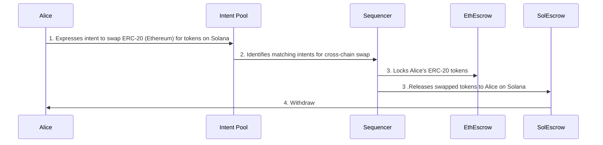

# Cross-Chain Swap and Bridge without Native Tokens

This use case is particularly appealing in the context of the decentralized finance (DeFi) space, where users often need to interact with multiple blockchain networks, each requiring its native token for transaction fees. Mycel simplifies this process, enhancing user experience and accessibility.

- **Eliminates Need for Native Tokens**: Users like Alice can engage in cross-chain activities without the complexity of acquiring and managing native tokens for gas fees on multiple networks.
- **Simplifies Cross-Chain Transactions**: By abstracting away the need for users to interact with bridges or worry about gas fees, Mycel makes cross-chain swaps more accessible and user-friendly.
- **Enhances User Experience**: Users can participate in the multi-chain ecosystem using only the tokens they intend to swap, making decentralized finance more seamless and inclusive.

## Usecase: **Alice Wants to Swap Tokens Across Chains without Holding Native Gas Tokens**

1. **Intent Declaration**: Alice uses the Mycel interface to declare her intent to swap ERC-20 tokens on Ethereum for another token on Solana, opting to pay the service fee with ERC-20 tokens, thus avoiding the need for native gas tokens.

2. **Intent Submission and Matching**: Her intent is submitted to the Multi-chain Intent Pool, where Mycel's sophisticated algorithms identify a matching intent that complements Alice's swap requirements.

3. **Sequencer and Escrow Interaction**: The Mycel sequencer orchestrates the transaction, interfacing with escrow mechanisms on both Ethereum and Solana. It locks Alice's ERC-20 tokens in an Ethereum-based escrow and signals a Solana escrow to prepare for delivering the swapped tokens.

4. **Withdraw Token**: Alice Withdraw SOL Token.

## Supported Chains (Upcoming)

- Ethereum
- Polygon
- Arbitrum
- Optimism
- BNB Chain
- Solana
- Sui
- IBC-enbaled Chains
