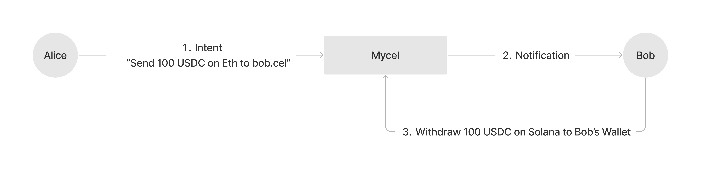

# ID based Cross-chain Transfer

Currently almost transactions in crypto are “Address based Transfer” but Mycel propose new style with Intent Centric Design, “ID based transfer”. Mycel ID holder can recieve any tokens on any blockchains if the person who want to send a token for Mycel ID holder.

## Facilitating Multi-Chain Asset Transfer Without Wallet Address

Our system allows for the sending and receiving of tokens across different blockchains using merely an ID, effectively eliminating the traditional reliance on wallet addresses and network specifics.

- **User Expresses Intent Across Chains**: For instance, Alice decides to send USDC from Ethereum to Bob on Solana. Rather than dealing with the intricacies of cross-chain bridges or the hassle of managing different wallets and native tokens, Alice states her intent to transfer assets to "bob.cel." Network fees are handled in USDC, eliminating the need for Alice or Bob to worry about acquiring native tokens like ETH or SOL.
- **Recipient Can Claim Without Immediate Wallet Preparation**: A standout feature of this system is the flexibility it offers recipients like Bob. Upon Alice's successful transfer, Bob, identified through "bob.cel," can claim the transferred assets without having previously set up a specific wallet for reception. This mirrors the convenience seen in centralized exchange (CEX) withdrawals, where assets can be allocated and withdrawn at the recipient's discretion, at any time, and without the upfront requirement of a wallet.
- **Intent-Centric, Multi-Chain Orchestration**: Seamlessly, the system executes Alice's intent, leveraging sophisticated multi-chain infrastructure to ensure a smooth transition of tokens from Ethereum to Solana. This orchestration covers everything from selecting the most efficient transfer routes and managing cross-chain communication to validating transaction integrity—all while remaining invisible to both Alice and Bob.

This practical implementation of our Intent-Centric Interface underscores not only the feasibility of simplifying blockchain interactions but also our vision of a blockchain ecosystem where multi-chain operations are as straightforward as single-chain transactions. Our dedication to this vision signifies our belief in the power of blockchain to be universally accessible, empowering users with the freedom to interact across any blockchain with ease and confidence.
